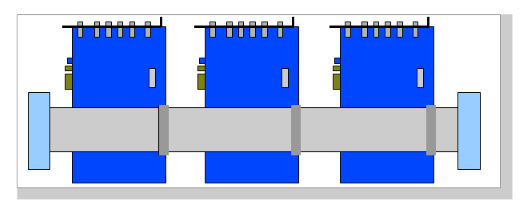
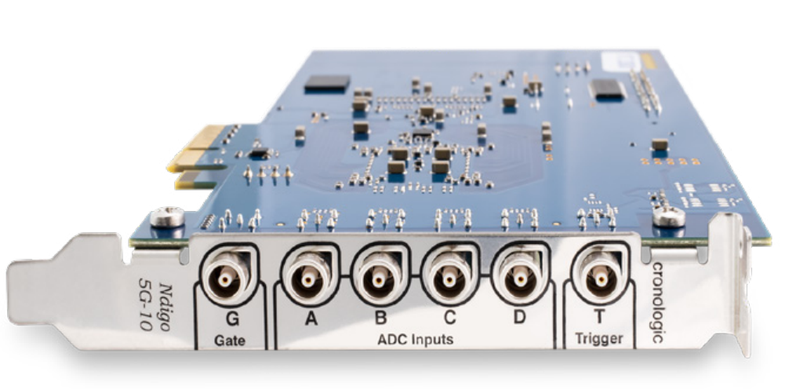
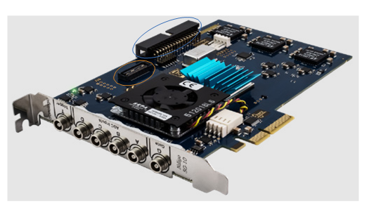
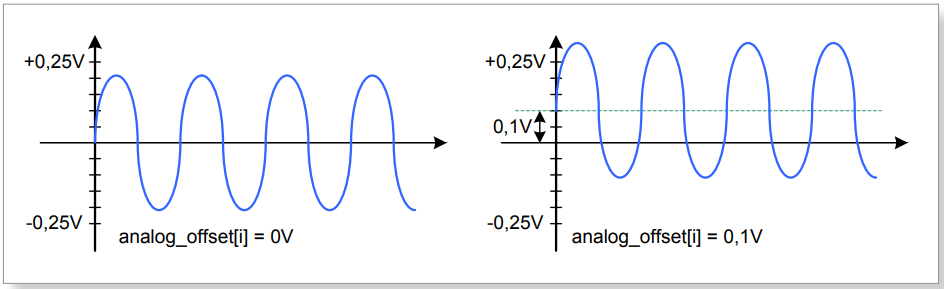
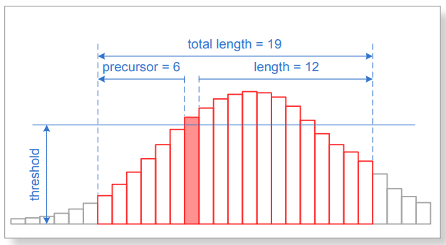
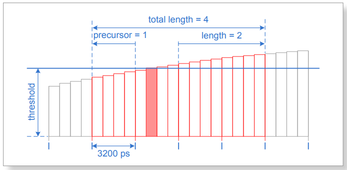
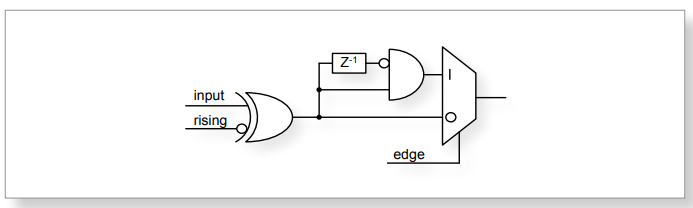
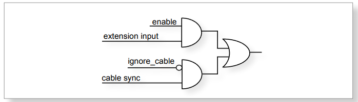

Hardware
========

Installing the Board
--------------------

The **Ndigo5G board** can be installed in any x4 (or higher amount of lanes)
PCIe slot. If the slot electrically supports less than 4 lanes, the
board will operate at lowerdata throughput rates.

Please ensure proper cooling of the device. The **Ndigo5G** has an onboard
temperature detection. If the ADC chip temperature exceeds
90C a warning is issued to the device driver. In
case the temperature is higher than 95C the ADC is
disabled to avoid damage. Using a PCI-slot cooler is in many cases an
appropriate solution to circumvent problems caused by overheating if the
board is used inside a PC. The Ndigo-Crate will provide sufficient
cooling under normal operating conditions.

Using a single **Ndigo5G**, no further connections need to be made.

For applications that require more than 4 ADC channels, several Ndigo boards
can be operated in sync. Any board of the **Ndigo product line** can be
synced to other Ndigo boards, allowing, for instance, for a combination
of high speed ADCs (**Ndigo5G**) and slower high resolution ADCs
(**Ndigo250M-14**).

The signals used for board synchronization and inter-board triggering
are transferred on a bus be-tween the boards. Join all C2 connectors
(see `Fig 2.3`_  on page 3) on the
boards using a ribbon cable. Both ends of the bus need to be terminated
properly. If using a **Ndigo Crate**, connectors providing the termination
are located on the crate mainboard next to the PCIe slots to the extreme
left and right. <more details, peas.e refer to the Ndigo Crate user
guide. In applications that use only a few Ndigo boards installed
directly inside a PC, termination PCBs available from cronologic can be
used.

**Ndigo5G’s** standard device driver can be used to read out all boards and
acquire data. For more complex scenarios, using the cronoSync-library,
which is part of cronoTools, is recommended. The cronoSync library is
provided with the Ndigo device driver. Please refer to the cronoTools
user guide for more information.

.. _Fig 2.1:
.. role:: invisible

:invisible:`hidden text`

   Figure 2.1: If several Ndigo boards are connected to work in sync, the boards
   must be connected using a ribbon cable as bus for synchronization and
   trigger signals. Proper termination is required at both ends of the cable.

.. raw:: pdf

    PageBreak

Ndigo5G External Inputs and Connectors
--------------------------------------

Connectors
~~~~~~~~~~

The inputs of the **Ndigo5G** are located on the PCI bracket.
`Fig 2.3`_ on page 3 shows the location of the
4 analog inputs A to D and the two digital inputs G (GATE) and T
(Trigger). Furthermore, two board interconnection connectors can be
found at the top edge of the **Ndigo5G**, as displayed in
`Fig 2.3`_ on page 3. Connector C1 is used
for a board-to-board connection (e. g. to link a HPTDC8-PCI and a
**Ndigo5G** via a **Ndigo Extension board**, see chapter 2.3).
Connector C2 is used as a bus interface
between multiple Ndigo boards distributing clock, trigger and sync
signals. Proper termination must be placed at both ends of the bus
interconnection ribbon cable.

.. _Fig 2.2:
.. role:: invisible

:invisible:`hidden text`

   Figure 2.2: Input connectors of an Ndigo5G located on the PCI bracket.

.. _Fig 2.3:
.. role:: invisible

:invisible:`hidden text`

   Figure 2.3: Ndigo5G board showing inter-board connectors C1 and C2.

Analog Inputs
~~~~~~~~~~~~~

.. _Fig 2.4:
.. role:: invisible

:invisible:`hidden text`

.. figure:: figures/InputCircuit.png
   :alt: alternative text
   :width: 2000
   :height: 300

   Figure 2.4: Input circuit for each of the four analog channels.

The analog inputs of the ADC are single ended LEMO00 coax connectors.
The inputs have a :math:`50\Omega` impedance and are AC coupled. The
inputs are converted to a differential signal using a balun.

Analog Offsets
^^^^^^^^^^^^^^

AC coupling removes the common mode voltage from the input signal. Users
can move the common mode voltage to a value of their choice using the
analogoffset parameter of each channel before sampling.

This feature is useful for highly asymmetric signals, such as pulses
from TOF spectrometers or LIDAR systems. Without analog offset
compensation, the pulses would begin in the middle of the ADC range,
effectively cutting the dynamic range in half (see `Fig 2.6`_ ). By shifting the DC baseline to
one end of the ADC range, the input range can be used fully, providing
the maximum dynamic range. The analog offset can be set between
:math:`\pm 0,25V`.

.. _Fig 2.5:
.. role:: invisible

:invisible:`hidden text`

   Figure 2.5: Users can add analog offset to the input before sampling

.. raw:: pdf

    PageBreak

.. _Fig 2.6:
.. role:: invisible

:invisible:`hidden text`

.. figure:: figures/AnalogOffset_Pulse.png
   :alt: alternative text
   :width: 2000
   :height: 300

   Figure 2.6: Asymmetric signal shifted to increase dynamic range

Digital Inputs
~~~~~~~~~~~~~~

There are two digital inputs on the front slot cover called Trigger and
GATE.

Both inputs provide a digital input signal routed to the trigger matrix.
These signals can be used to trigger any of the trigger state machines
and gating blocks. The inputs are AC coupled. DC offset is configurable
via  **dc_offset_parameter** in the **configurations structure** to
support positive and negative input pulses.

The configuration is set via the structures **trigger[8] and trigger[9]** in
the **configuration structure**.The input circuit is shown in
Figure 2.17  on page 15.

TDC on Trigger Input
^^^^^^^^^^^^^^^^^^^^

There is a TDC connected to the Trigger input. When used with the TDC,
the Trigger input supports negative pulses only . The TDC creates
packets of **type 8**. These packets first contain a coarse timestamp and a
payload that can be used to calculate the trigger position with higher
precision. The function **ndigo_process_tdc_packet()** can be used to replace
the coarse timestamp with the precise timestamp. This function is
described in `Section 3.6`_ on page 25 . TDC pulses
must have a minimum duration of 3.3ns. The dead-time of the TDC is 32ns.

.. raw:: pdf

    PageBreak

Extension Card
--------------

The Ndigo Extension card provides additional inputs or outputs to the
FPGA. It is connected to the C1(Samtec QSS-025) connector on an **Ndigo5G** by
an Samtec SQCD cable assembly.

The **Ndigo Extension Card** provides up to ten single ended LEMO00
connectors. The circuit connecting to each of these circuits can be
chosen to provide inputs or outputs. These can be AC or DC coupled. AC
coupled inputs support NIM signaling.

The signals connect to 2.5V IO Pins of the Xilinx Virtex-5 FPGA.
The current firmware revision provides the following signal connections.

.. container:: small

      +-----------------+---------+----------+-----------+-----------------+
      | Connector       | QSS Pin | FPGA Pin | Direction | Signal          |
      +=================+=========+==========+===========+=================+
      | LEMO00: CH0     | 22      | AD9      | Input     | Ndigo Extension |
      |                 |         |          |           | digital channel |
      |                 |         |          |           | 0               |
      +-----------------+---------+----------+-----------+-----------------+
      | LEMO00: CH1     | 18      | AE10     | Input     | Ndigo Extension |
      |                 |         |          |           | digital channel |
      |                 |         |          |           | 1               |
      +-----------------+---------+----------+-----------+-----------------+
      | LEMO00: CH2     | 14      | D10      |           | not connected   |
      +-----------------+---------+----------+-----------+-----------------+
      | LEMO00: CH3     | 10      | AF9      | Output    | 39.0625 MHz     |
      |                 |         |          |           | clock for HPTDC |
      +-----------------+---------+----------+-----------+-----------------+
      | LEMO00: CH4     | 6       | AD11     | Output    | 39.0625 MHz     |
      |                 |         |          |           | clock for HPTDC |
      +-----------------+---------+----------+-----------+-----------------+
      | LEMO00: CH5     | 5       | AE7      | Output    | 39.0625 MHz     |
      |                 |         |          |           | clock for HPTDC |
      +-----------------+---------+----------+-----------+-----------------+
      | LEMO00: CH6     | 9       | AF7      | Output    | 39.0625 MHz     |
      |                 |         |          |           | clock for HPTDC |
      +-----------------+---------+----------+-----------+-----------------+
      | LEMO00: CH7     | 13      | D9       |           | not connected   |
      +-----------------+---------+----------+-----------+-----------------+
      | LEMO00: CH8     | 17      | V9       | Input     | Ndigo Extension |
      |                 |         |          |           | digital channel |
      |                 |         |          |           | 2               |
      +-----------------+---------+----------+-----------+-----------------+
      | LEMO00: CH9     | 21      | W9       | Input     | Ndigo Extension |
      |                 |         |          |           | digital channel |
      |                 |         |          |           | 3               |
      +-----------------+---------+----------+-----------+-----------------+
      | SYNC1:          | 26      | F9       |           | not connected   |
      | Sync-TDC8       |         |          |           |                 |
      +-----------------+---------+----------+-----------+-----------------+
      | SYNC1:          | 44      | AA7      | Output    | Sync for HPTDC  |
      | Sync-HPTDC      |         |          |           |                 |
      +-----------------+---------+----------+-----------+-----------------+

The 4 digital inputs are routed to the bus inputs of the trigger matrix
to be used for triggering. The routing can be configured to either ORing
the sync bus and extension channels or use the extension channels
exclusively.

.. container:: small

   +-------------+-----------------+---------------------------+----------------------+
   | Connector   | Extension Card  | Trigger matrix input      | Trigger matrix input |
   +-------------+-----------------+---------------------------+----------------------+
   |             | Digital Channel | ignorecable = 0           | ignorecable = 1      |
   +-------------+-----------------+---------------------------+----------------------+
   | LEMO00: CH0 | 0               | BUS0 = EXT0  Sync Cable 0 | BUS0 = EXT0          |
   +-------------+-----------------+---------------------------+----------------------+
   | LEMO00: CH1 | 1               | BUS1 = EXT1  Sync Cable 1 | BUS1 = EXT1          |
   +-------------+-----------------+---------------------------+----------------------+
   | LEMO00: CH8 | 2               | BUS2 = EXT2  Sync Cable 2 | BUS2 = EXT2          |
   +-------------+-----------------+---------------------------+----------------------+
   | LEMO00: CH9 | 3               | BUS3 = EXT3  Sync Cable 3 | BUS3 = EXT3          |
   +-------------+-----------------+---------------------------+----------------------+

Ndigo5G Functionality
---------------------

ADC Modes
~~~~~~~~~

Depending on board configuration, the analog input signal is quantized
to 8 or 10 bits. However, the board always scales and offsets the data
to 16 bit signed data centered around 0.

Data processing such as trigger detection or packet building are always
performed on **3.2ns** intervals. Depending on the ADC mode, this interval
may contain 4, 8 or 16 samples.

The board supports using one, two or four channels:

1 Channel Modes A, B, C and D
^^^^^^^^^^^^^^^^^^^^^^^^^^^^^
In these modes, only a single channel is used. The analog signal on that
channel is digitized at 5Gsps. Packet size is always a multiple of 16
samples per **3.2ns** . See `Fig 2.9`_
on page 8 and  `Fig 2.15`_ on page 11.

2 Channel Modes AC, BC, AD and BD
^^^^^^^^^^^^^^^^^^^^^^^^^^^^^^^^^

In these modes, two channels are used simultaneously. The analog signals
on these channels are digitized at **2.5Gsps** each. Packet size is always a
multiple of 8 samples per **3.2ns**. See `Fig 2.8`_ on page 8
and see `Fig 2.14`_ on page 11.

4 Channel Mode ABCD
^^^^^^^^^^^^^^^^^^^

In this mode, all four channels are digitized independently at **1.25Gsps**
each. The packet size is always a multiple of 4 samples per **3.2ns**. See
`Fig 2.7`_ on page 8 and see `Fig 2.13`_ on page 11.

Multiple Sampling Modes AAAA, BBBB, CCCC and DDDD
^^^^^^^^^^^^^^^^^^^^^^^^^^^^^^^^^^^^^^^^^^^^^^^^^

In these modes, only one analog input channel is used, but the channel is sampled independently
and simultaneously by four ADCs at **1.25Gsps**.The board creates four independent streams with
4 samples each per **3.2ns**.

Using the same trigger setting on all ADCs, can be used to reduce noise
by averaging the four channels. To deal with complex triggering
conditions, different trigger settings on each of the ADCs can be used.

The **Ndigo5G** provides 4 ADCs sampling at **1.25Gsps** each. Higher speed
modes are implemented by interleaving two or four of these ADCs.

During interleaving, the **Ndigo5G** firmware reorders and groups the data
into a linear sample stream. The process is fully transparent. For
users, the only difference is that a **3.2ns** cycle can contain 4, 8 or 16
samples, depending on mode.

.. raw:: pdf

    PageBreak

.. _Fig 2.7:
.. role:: invisible

:invisible:`hidden text`

.. figure:: figures/4ChannelMode.png
   :alt: alternative text
   :width: 2000
   :height: 300

   Figure 2.7: ADCs in 4 channel mode ABCD at 1.25Gsps.

.. _Fig 2.8:
.. role:: invisible

:invisible:`hidden text`

.. figure:: figures/2ChannelMode.png
   :alt: alternative text
   :width: 2000
   :height: 300

   Figure 2.8: ADCs in 2 channel mode AD, interleaved for 2.5Gsps.

.. _Fig 2.9:
.. role:: invisible

:invisible:`hidden text`

.. figure:: figures/1ChannelMode.png
   :alt: alternative text
   :width: 2000
   :height: 300

   Figure 2.9: ADCs in 1 channel mode A, B, C or D interleaved for 5Gsps.

Zero Suppression
~~~~~~~~~~~~~~~~

One of **Ndigo5G’s** key features is on-board zero suppression to reduce
PCIe bus load. Only data that passes specifications predefined by the
user is transmitted. This guide refers to transmitted waveform data as
“packets”. A packet contains the waveform data and a timestamp giving
the absolute time (i.e. the time since start of data acquisition) of the
packet’s last sample.

`Fig 2.14`_ shows a simple example: Data
is written to the PC only if values exceed a specified threshold.
Expanding on that, **Ndigo5G’s** zero suppression can be used to realize
much more complex scenarios.

.. raw:: pdf

    PageBreak

.. _Fig 2.10:
.. role:: invisible

:invisible:`hidden text`

.. figure:: figures/ZeroSupp.png
   :alt: alternative text
   :width: 1300
   :height: 900

   Figure 2.10: Simple zero suppression: Only data
   with values above a threshold are written to the PC.

Trigger Blocks
~~~~~~~~~~~~~~

**Ndigo5G-10** and **Ndigo5G-8** record analog waveforms using zero suppression.
Whenever a relevant waveform is detected, data is written to an internal
FIFO memory. Each ADC channel has one trigger block determining whether
data is written to the FIFO. The parameters are set in Structure
**ndigo_trigger_block** (See chapter 3.4.3 on page 36).

Each trigger block consists of two independent units that check the
incoming raw data stream for trigger conditions ( `Fig 2.10`_ on page 9). Users can specify a
threshold and can choose whether triggering is used whenever incoming
data is below or above the threshold (level triggering) or only if data
exceeds the threshold (edge triggering).

A gate length can be set to extend the trigger window by multiples of
**3.2ns**. Furthermore, if users choose precursor values > 0, the
trigger unit will start writing data to the FIFO precursor
3:2ns before the trigger event.

When using edge triggering, all packets have the same length ( `Fig 2.11`_ on page 10):
precursor + length + 1 cycles of **3.2ns**. For level
triggering, packet length is data dependent ( `Fig 2.12`_ on page 10).

Please note that triggering is not accurate to sample. For each **3.2ns**
clock cycle, it is determined whether on any sample during that clock
cycle a trigger condition is met. The clock cycle is then selected as
the trigger point. As a result, the trigger sample can be anywhere
within a range of up to 16 samples in single channel mode ( `Fig 2.15`_
on page 11 ) at 16 samples per **3.2ns** .

If retriggering is active, the current trigger window is extended if a
trigger event is detected inside the window.

A trigger block can use several input sources:

-  the 8 trigger decision units of all four ADC channels ( `Fig 2.16`_  on page 12)

-  the GATE input (`Fig 2.17`_ on page 12)

-  the Trigger or TDC input, ( `Fig 2.17`_ on page 12 )

-  a function trigger providing random or periodic triggering.

-  triggers originating from other cards connected with the sync cable
   or from the Ndigo Extension card (BUS0, BUS1, BUS2, BUS3)

-  A second set of trigger units with names ending in pe for the digital
   inputs Trigger, GATE, BUS0, BUS1, BUS2, and BUS3 configured for
   positive edge triggering. Together with the regular trigger units on
   this inputs, both edges of a pulse can be used in the trigger logic.
   This set of triggers is not available as inputs for the gate blocks.

Trigger inputs from the above sources can be concatenated using logical
OR ( `Fig 2.19`_ on page 13) by
setting the appropriate bits in the trigger blocks source mask.

Triggers can be fed into the gate blocks described on page ( `Fig 2.20`_ Gate blocks can be used to
block writing data to the FIFO. That way, only zero suppressed data
occurring when the selected gate is active is transmitted. This
procedure reduces PCIe bus load even further ( `Fig 2.20`_ ).

.. _Fig 2.11:
.. role:: invisible

:invisible:`hidden text`

   Figure 2.11: Parameters for edge triggering

.. _Fig 2.12:
.. role:: invisible

:invisible:`hidden text`

.. figure:: figures/level-trigger.png
   :width: 1300
   :height: 800

   Figure 2.12: Parameters for level triggering

.. _Fig 2.13:
.. role:: invisible

:invisible:`hidden text`

   Figure 2.13: Triggering in 4 channel mode at 4 samples per clock cycle.

.. _Fig 2.14:
.. role:: invisible

:invisible:`hidden text`

.. figure:: figures/2ChannelTriggering.png
   :width: 1300
   :height: 800

   Figure 2.14: Triggering in 2 channel mode at 8 samples per clock cycle.

.. _Fig 2.15:
.. role:: invisible

:invisible:`hidden text`

.. figure:: figures/1ChannelTriggering.png
   :width: 1300
   :height: 800

   Figure 2.15: Triggering in 1 channel mode at 16 samples per clock cycle.

.. _Fig 2.16:
.. role:: invisible

:invisible:`hidden text`

.. figure:: figures/analog-trigger.png
   :width: 1300
   :height: 800

   Figure 2.16: From the ADC inputs, a trigger unit creates an input flag for
   the trigger matrix. Each digitizer channel (A, B, C, D) has two trigger units.

.. _Fig 2.17:
.. role:: invisible

:invisible:`hidden text`

   Figure 2.17: The digital inputs Trigger, GATE,
   BUS0, BUS1, BUS2 and BUS3 have simpler trigger units.

.. _Fig 2.18:
.. role:: invisible

:invisible:`hidden text`

   Figure 2.18: The extension block combines signals from
   the optional extension board and the sync cable.

.. _Fig 2.19:
.. role:: invisible

:invisible:`hidden text`

.. figure:: figures/triggermatrix.png
   :width: 2000
   :height: 300

   Figure 2.19: Trigger Matrix: The trigger signals of each ADC channel, the trigger
   input, the GATE input or the sync cable can be combined to create a
   trigger input for each trigger block. The four gate signals can be used
   to suppress triggers during certain time frames.

.. _Fig 2.20:
.. role:: invisible

:invisible:`hidden text`

.. figure:: figures/GatingBlocks.png
   :width: 2000
   :height: 300

   Figure 2.20: Gating Blocks: Each gating block can use an arbitrary combination
   of inputs to trigger its state machine. The outputs can be individually
   inverted and routed to the AND-gate feeding the trigger blocks.

