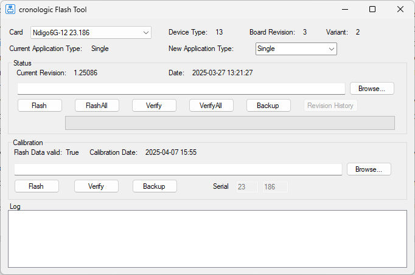

============================
Performing a firmware update
============================

The Ndigo6G-12 device driver includes the tool *FirmwareGUI_64.exe*. It can be used
to perform a firmware update.

The tool is located in your device driver installation path under :code:`apps\\x64\\`.

The tool is shown in :numref:`Figure %s<flash tool>`.

.. _flash tool:

    Firmware flash tool for the Ndigo6G-12.

Procedure
---------
1. If you have multiple Ndigo6G-12 installed, choose a card in the “Card” dropdown menu.
2. It is advisable to perform a backup of the current firmware and calibration data.
   Click the respective “Backup” button in the tool.
3. Optionally select the application type that you wish to use. This step is not
   required and can also be performed when configuring the Ndigo6G-12 in your user
   software.
4. Browse to the new firmware file: In the “Status” section, click on “Browse”.
   The firmware that is delivered with the device
   driver is located at :code:`firmware\\Ndigo6G_Firmware_YYYYMMDD.cronorom`.
5. Optionally compare the currently installed firmware with the selected firmware
   by pressing “Verify”.
6. Click “Flash” to perform the firmware update.

.. attention::

    The new firmware will only be used after a *complete* power cycle. A simple
    reboot may not be sufficient.

.. attention::
    
    After a firmware update the TDCs have to be re-calibrated.
    See :doc:`./calibration` for the procedure.

