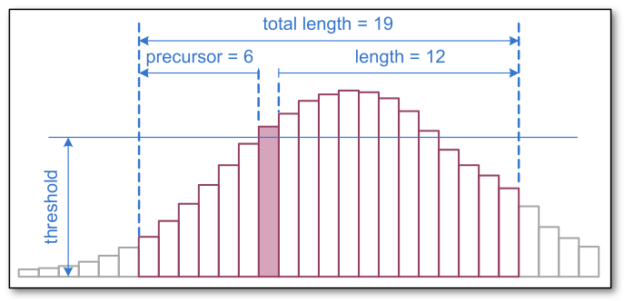
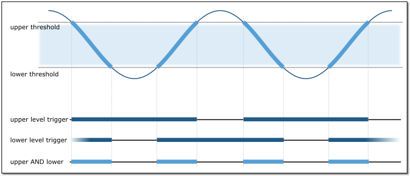
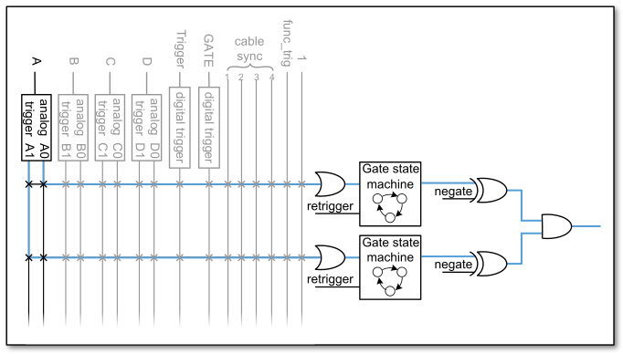

Hardware
========

Installing the Board
--------------------

The **Ndigo6G** board can be installed in any **x4** (or higher amount
of lanes) PCIe slot. If the slot electrically supports less than 4 lanes, the
board will operate at lowerdata throughput rates.

Please ensure proper cooling of the device. The Ndigo5G has an onboard
temperature detection. If the ADC chip temperature exceeds
90 |nbws| C a warning is issued to the device driver. In
case the temperature is higher than 95 |nbws| C the ADC is
disabled to avoid damage. Using a PCI-slot cooler is in many cases an
appropriate solution to circumvent problems caused by overheating if the
board is used inside a PC. The Ndigo-Crate will provide sufficient
cooling under normal operating conditions.

Using a single **Ndigo6G**, no further connections need to be made.

For applications that require more than four ADC channels, several Ndigo
boards can be operated in sync. Any board of the **Ndigo product line** can be
synced to other Ndigo boards, allowing, for instance, for a combination
of high speed ADCs (e.g., **Ndigo6G**) and slower high resolution ADCs
(**Ndigo250M-14**).

The signals used for board synchronization and inter-board triggering
are transferred on a bus between the boards. Join all C2 connectors
(see :numref:`Figure %s<Fig 2.3>`) on the
boards using a ribbon cable. Both ends of the bus need to be terminated
properly. If using a **Ndigo Crate**, connectors providing the termination
are located on the crate mainboard next to the PCIe slots to the extreme
left and right. <more details, peas.e refer to the Ndigo Crate user
guide. In applications that use only a few Ndigo boards installed
directly inside a PC, termination PCBs available from cronologic can be
used.

The standard device driver of the **Ndigo6G** can be used to read out all
boards and acquire data. For more complex scenarios, using the
**cronoSync-library**, which is part of cronoTools, is recommended. The
**cronoSync-library** is provided with the Ndigo device driver. Please refer to
the **cronoTools User Guide** for more information.

.. _Fig 2.1:
.. figure:: figures/Ndigo_Intercon.*

   If several Ndigo boards are connected to work in sync, the boards
   must be connected using a ribbon cable as bus for synchronization and
   trigger signals. Proper termination is required at both ends of the cable.

Ndigo6G External Inputs and Connectors
--------------------------------------

Connectors
~~~~~~~~~~

The inputs of the **Ndigo6G** are located on the PCI bracket.
:numref:`Figure %s<Fig 2.3>` shows the location of the
four analog inputs A to D and the two digital inputs G
(GATE) and T (Trigger). Furthermore, two board interconnection
connectors can be found at the top edge of the **Ndigo6G** board, as displayed
in :numref:`Figure %s<Fig 2.3>`. Connector C1 is used
for a board-to-board connection (e. g., to link a **HPTDC8-PCI** and a
**Ndigo5G** via a **Ndigo Extension Board**, see
:numref:`Chapter %s<hardware:Extension Card>`).
Connector C2 is used as a bus interface
between multiple Ndigo boards distributing clock, trigger and sync
signals. Proper termination must be placed at both ends of the bus
interconnection ribbon cable.

.. _Fig 2.2:
.. figure:: figures/Ndigo-Slotblende.*

    Input connectors of an **Ndigo6G** board located on the PCI bracket.

.. _Fig 2.3:
.. figure:: figures/Ndigo_schematic.*

    **Ndigo6G** board showing inter-board connectors C1 and C2.

Analog Inputs
~~~~~~~~~~~~~

.. _Fig 2.4:
.. figure:: figures/InputCircuit.*

   Input circuit for each of the four analog channels.

The analog inputs of the ADC are single ended LEMO00 coax connectors.
The inputs have a 50 |nbws| Ω  impedance and are AC coupled. The
inputs are converted to a differential signal using a balun.

Analog Offsets
^^^^^^^^^^^^^^

AC coupling removes the common mode voltage from the input signal. Users
can move the common mode voltage to a value of their choice using the
analogoffset parameter of each channel before sampling.

This feature is useful for highly asymmetric signals, such as pulses
from TOF spectrometers or LIDAR systems. Without analog offset
compensation, the pulses would begin in the middle of the ADC range,
effectively cutting the dynamic range in half
(see :numref:`Figure %s<Fig 2.6>`).
By shifting the DC baseline to one end of the ADC range, the input range
can be used fully, providing the maximum dynamic range. The analog offset
can be set between :math:`\pm` 0.25 |nbws| V.

.. _Fig 2.5:
.. figure:: figures/AnalogOffset_Sine.*

   Users can add analog offset to the input before sampling

.. _Fig 2.6:
.. figure:: figures/AnalogOffset_Pulse.*

   Asymmetric signal shifted to increase dynamic range

Digital Inputs
~~~~~~~~~~~~~~

There are two digital inputs on the front slot cover called *Trigger* (T) and
*Gate* (G).

Both inputs provide a digital input signal routed to the trigger matrix.
These signals can be used to trigger any of the trigger state machines
and gating blocks. The inputs are AC coupled. A DC offset is configurable
via  :code:`dc_offset_parameter` in the *configurations structure* to
support positive and negative input pulses.

The configuration is set via the structure's :code:`trigger[8]` and
:code:`trigger[9]` in the *configuration structure*.The input circuit is shown
in :numref:`Figure %s<Fig 2.17>`.

TDC on Trigger Input
^^^^^^^^^^^^^^^^^^^^

A time-to-digital (TDC) connected to the Trigger input.
The TDC creates packets of **type 8**. These packets first contain a coarse
timestamp and a payload that can be used to calculate the trigger position with higher
precision. The function :code:`ndigo_process_tdc_packet` can be used to replace
the coarse timestamp with the precise timestamp. This function is
described in :numref:`Chapter %s<api:Readout>`. TDC pulses
must have a minimum duration of 3.3 |nbws| ns. The dead-time of the TDC is
32 |nbws| ns.

.. note::

   When used with the TDC, the Trigger input supports negative pulses only. 

Extension Card
--------------

The **Ndigo Extension Card** provides additional inputs or outputs to the
FPGA. It is connected to the C1 (Samtec QSS-025) connector on an **Ndigo5G** by
an Samtec SQCD cable assembly.

The **Ndigo Extension Card** provides up to ten single ended LEMO00
connectors. The circuit connecting to each of these circuits can be
chosen to provide inputs or outputs. These can be AC or DC coupled. AC
coupled inputs support NIM signaling.

The signals connect to 2.5 |nbws| V IO Pins of the Xilinx Virtex-5 FPGA.
The current firmware revision provides the following signal connections.

.. container:: small

      +-----------------+---------+----------+-----------+-----------------+
      | Connector       | QSS Pin | FPGA Pin | Direction | Signal          |
      +=================+=========+==========+===========+=================+
      | LEMO00: CH0     | 22      | AD9      | Input     | Ndigo Extension |
      |                 |         |          |           | digital channel |
      |                 |         |          |           | 0               |
      +-----------------+---------+----------+-----------+-----------------+
      | LEMO00: CH1     | 18      | AE10     | Input     | Ndigo Extension |
      |                 |         |          |           | digital channel |
      |                 |         |          |           | 1               |
      +-----------------+---------+----------+-----------+-----------------+
      | LEMO00: CH2     | 14      | D10      |           | not connected   |
      +-----------------+---------+----------+-----------+-----------------+
      | LEMO00: CH3     | 10      | AF9      | Output    | 39.0625 MHz     |
      |                 |         |          |           | clock for HPTDC |
      +-----------------+---------+----------+-----------+-----------------+
      | LEMO00: CH4     | 6       | AD11     | Output    | 39.0625 MHz     |
      |                 |         |          |           | clock for HPTDC |
      +-----------------+---------+----------+-----------+-----------------+
      | LEMO00: CH5     | 5       | AE7      | Output    | 39.0625 MHz     |
      |                 |         |          |           | clock for HPTDC |
      +-----------------+---------+----------+-----------+-----------------+
      | LEMO00: CH6     | 9       | AF7      | Output    | 39.0625 MHz     |
      |                 |         |          |           | clock for HPTDC |
      +-----------------+---------+----------+-----------+-----------------+
      | LEMO00: CH7     | 13      | D9       |           | not connected   |
      +-----------------+---------+----------+-----------+-----------------+
      | LEMO00: CH8     | 17      | V9       | Input     | Ndigo Extension |
      |                 |         |          |           | digital channel |
      |                 |         |          |           | 2               |
      +-----------------+---------+----------+-----------+-----------------+
      | LEMO00: CH9     | 21      | W9       | Input     | Ndigo Extension |
      |                 |         |          |           | digital channel |
      |                 |         |          |           | 3               |
      +-----------------+---------+----------+-----------+-----------------+
      | SYNC1:          | 26      | F9       |           | not connected   |
      | Sync-TDC8       |         |          |           |                 |
      +-----------------+---------+----------+-----------+-----------------+
      | SYNC1:          | 44      | AA7      | Output    | Sync for HPTDC  |
      | Sync-HPTDC      |         |          |           |                 |
      +-----------------+---------+----------+-----------+-----------------+

The four digital inputs are routed to the bus inputs of the trigger matrix
to be used for triggering. The routing can be configured to either *OR*\ ing
the sync bus and extension channels or use the extension channels
exclusively.

.. container:: small

   +-------------+-----------------+--------------------------+----------------------+
   | Connector   | Extension Card  | Trigger matrix input     | Trigger matrix input |
   +-------------+-----------------+--------------------------+----------------------+
   |             | Digital Channel | ignorecable = 0          | ignorecable = 1      |
   +-------------+-----------------+--------------------------+----------------------+
   | LEMO00: CH0 | 0               | BUS0 = EXT0 Sync Cable 0 | BUS0 = EXT0          |
   +-------------+-----------------+--------------------------+----------------------+
   | LEMO00: CH1 | 1               | BUS1 = EXT1 Sync Cable 1 | BUS1 = EXT1          |
   +-------------+-----------------+--------------------------+----------------------+
   | LEMO00: CH8 | 2               | BUS2 = EXT2 Sync Cable 2 | BUS2 = EXT2          |
   +-------------+-----------------+--------------------------+----------------------+
   | LEMO00: CH9 | 3               | BUS3 = EXT3 Sync Cable 3 | BUS3 = EXT3          |
   +-------------+-----------------+--------------------------+----------------------+

Ndigo5G Functionality
---------------------

ADC Modes
~~~~~~~~~

Depending on board configuration, the analog input signal is quantized
to 8 or 10 bits. However, the board always scales and offsets the data
to 16 bit signed data centered around 0.

Data processing such as trigger detection or packet building are always
performed on 3.2 |nbws| ns intervals. Depending on the ADC mode, this interval
may contain 4, 8 or 16 samples.

The board supports using one, two or four channels:

1 Channel Modes A, B, C and D
^^^^^^^^^^^^^^^^^^^^^^^^^^^^^
In these modes, only a single channel is used. The analog signal on that
channel is digitized at 5Gsps. Packet size is always a multiple of 16
samples per 3.2 |nbws| ns (See :numref:`Figures %s<Fig 2.9>`
and :numref:`%s<Fig 2.15>`).

2 Channel Modes AC, BC, AD and BD
^^^^^^^^^^^^^^^^^^^^^^^^^^^^^^^^^

In these modes, two channels are used simultaneously. The analog signals
on these channels are digitized at **2.5** |nbws| **Gsps** each.
Packet size is always a multiple of 8 samples per
3.2 |nbws| ns (See :numref:`Figures %s<Fig 2.8>` and
:numref:`%s<Fig 2.14>`).

4 Channel Mode ABCD
^^^^^^^^^^^^^^^^^^^

In this mode, all four channels are digitized independently at 1.25 |nbws| Gsps
each. The packet size is always a multiple of 4 samples per 3.2 |nbws| ns. (See
:numref:`Figures %s<Fig 2.7>` and :numref:`%s<Fig 2.13>`).

Multiple Sampling Modes AAAA, BBBB, CCCC and DDDD
^^^^^^^^^^^^^^^^^^^^^^^^^^^^^^^^^^^^^^^^^^^^^^^^^

In these modes, only one analog input channel is used, but the channel is
sampled independently and simultaneously by four ADCs at **1.25** |nbws|
**Gsps**. The board creates four independent streams with 4 samples each per
**3.2** |nbws| **ns**.

Using the same trigger setting on all ADCs, can be used to reduce noise
by averaging the four channels. To deal with complex triggering
conditions, different trigger settings on each of the ADCs can be used.

The **Ndigo5G** provides four ADCs sampling at **1.25** |nbws| **Gsps** each.
Higher speed modes are implemented by interleaving two or four of these ADCs.

During interleaving, the **Ndigo5G** firmware reorders and groups the data
into a linear sample stream. The process is fully transparent. For
users, the only difference is that a **3.2** |nbws| **ns** cycle can contain
4, 8 or 16 samples, depending on mode.

.. _Fig 2.7:
.. figure:: figures/4ChannelMode.*

    ADCs in 4 channel mode ABCD at 1.25 |nbws| Gsps.

.. _Fig 2.8:
.. figure:: figures/2ChannelMode.*

    ADCs in 2 channel mode AD, interleaved for 2.5 |nbws| Gsps.

.. _Fig 2.9:
.. figure:: figures/1ChannelMode.*

    ADCs in 1 channel mode A, B, C or D interleaved for 5 |nbws| Gsps.

Zero Suppression
~~~~~~~~~~~~~~~~

One key features of the **Ndigo6g** is on-board zero suppression to reduce
PCIe bus load. Only data that passes specifications predefined by the
user is transmitted. This guide refers to transmitted waveform data as
“packets”. A packet contains the waveform data and a timestamp giving
the absolute time (i.e. the time since start of data acquisition) of the
packet’s last sample.

:numref:`Figure %s<Fig 2.14>` shows a simple example: Data
is written to the PC only if values exceed a specified threshold.
Expanding on that, **Ndigo5G**'s zero suppression can be used to realize
much more complex scenarios.

.. _Fig 2.10:
.. figure:: figures/ZeroSupp.*

    Simple zero suppression: Only data
    with values above a threshold are written to the PC.

Trigger Blocks
~~~~~~~~~~~~~~

**Ndigo5G-10** and **Ndigo5G-8** record analog waveforms using zero suppression.
Whenever a relevant waveform is detected, data is written to an internal
FIFO memory. Each ADC channel has one trigger block determining whether
data is written to the FIFO. The parameters are set in Structure
**ndigo_trigger_block** (See :numref:`Chapter %s<struct ndigoslowinfo>`).

Each trigger block consists of two independent units that check the
incoming raw data stream for trigger conditions (:numref:`Figure %s<Fig 2.10>`).
Users can specify a
threshold and can choose whether triggering is used whenever incoming
data is below or above the threshold (level triggering) or only if data
exceeds the threshold (edge triggering).

A gate length can be set to extend the trigger window by multiples of
**3.2** |nbws| **ns**. Furthermore, if users choose precursor values :math:`>`
0, the trigger unit will start writing data to the FIFO precursor
3.2 |nbws| ns before the trigger event.

When using edge triggering, all packets have the same length
(:numref:`Figure %s<Fig 2.11>`):
precursor + length + 1 cycles of **3.2** |nbws| **ns**. For level
triggering, packet length is data dependent (:numref:`Figure %s<Fig 2.12>`).

Please note that triggering is not accurate to sample. For each
**3.2** |nbws| **ns**
clock cycle, it is determined whether on any sample during that clock
cycle a trigger condition is met. The clock cycle is then selected as
the trigger point. As a result, the trigger sample can be anywhere
within a range of up to 16 samples in single channel mode
\(:numref:`Figure %s<Fig 2.15>`) at 16 samples per 3.2 |nbws| ns.

If retriggering is active, the current trigger window is extended if a
trigger event is detected inside the window.

A trigger block can use several input sources:

-  The 8 trigger decision units of all four ADC channels
   \(:numref:`Figure %s<Fig 2.16>`)
-  The GATE input (:numref:`Figure %s<Fig 2.17>`)
-  The Trigger or TDC input (:numref:`Figure %s<Fig 2.17>`)
-  A function trigger providing random or periodic triggering.
-  Triggers originating from other cards connected with the sync cable
   or from the Ndigo Extension card (BUS0, BUS1, BUS2, BUS3)
-  A second set of trigger units with names ending in pe for the digital
   inputs Trigger, GATE, BUS0, BUS1, BUS2, and BUS3 configured for
   positive edge triggering. Together with the regular trigger units on
   this inputs, both edges of a pulse can be used in the trigger logic.
   This set of triggers is not available as inputs for the gate blocks.

Trigger inputs from the above sources can be concatenated using logical
OR (:numref:`Figure %s<fig triggermatrix>`) by
setting the appropriate bits in the trigger blocks source mask.

Triggers can be fed into the gate blocks as described in
:numref:`Chapter %s<hardware:Gating Blocks>` \(:numref:`Figure %s<Fig 2.20>`).
Gate blocks can be used to block writing data to the FIFO. That way, only
zero suppressed data occurring when the selected gate is active is transmitted.
This procedure reduces PCIe bus load even further 
\(:numref:`Figure %s<Fig 2.20>`).

.. _Fig 2.11:

   Parameters for edge triggering.

.. _Fig 2.12:
.. figure:: figures/level-trigger.*

   Parameters for level triggering.

.. _Fig 2.13:
.. figure:: figures/4ChannelTriggering.*

   Triggering in 4 channel mode at 4 samples per clock cycle.

.. _Fig 2.14:
.. figure:: figures/2ChannelTriggering.*

   Triggering in 2 channel mode at 8 samples per clock cycle.

.. _Fig 2.15:
.. figure:: figures/1ChannelTriggering.*

   Triggering in 1 channel mode at 16 samples per clock cycle.

.. _Fig 2.16:
.. figure:: figures/analog-trigger.*

   From the ADC inputs, a trigger unit creates an input flag for
   the trigger matrix. Each digitizer channel (A, B, C, D) has two trigger
   units.

.. _Fig 2.17:
.. figure:: figures/DigitalInput.*

   The digital inputs Trigger, GATE,
   BUS0, BUS1, BUS2 and BUS3 have simpler trigger units.

.. _Fig 2.18:
.. figure:: figures/ExtensionBlock.*

   The extension block combines signals from
   the optional extension board and the sync cable.

.. _fig triggermatrix:
.. figure:: figures/triggermatrix.*

   Trigger Matrix: The trigger signals of each ADC channel, the trigger
   input, the GATE input or the sync cable can be combined to create a
   trigger input for each trigger block. The four gate signals can be used
   to suppress triggers during certain time frames.

Gating Blocks
~~~~~~~~~~~~~

.. _Fig 2.20:
.. figure:: figures/GatingBlocks.*

   Gating Blocks: Each gating block can use an arbitrary combination
   of inputs to trigger its state machine. The outputs can be individually
   inverted and routed to the AND-gate feeding the trigger blocks.

To decrease the amount of data transmitted to the PC, **Ndigo6G** includes four
independent gate and delay units. A gate and delay unit creates a gate
window starting at a specified time after a trigger, closing the window
at gate stop. Both timing values — gate start and gate stop — must be
set as multiples of 3.2 |nbws| ns.

Trigger blocks can use the gate signal to suppress data acquisition:
Only data that fulfills zero suppression specifications occurring in an
active gate window is written to the PC.

As input, any trigger from the four trigger blocks, the GATE and Trigger
inputs, a trigger from a connected board and the function generator can
be used.

The retrigger feature will create a new gate if a trigger occurs during
an active gate window. The gate signal can be inverted, causing an
active gate to close for a time defined by the user.

The parameters of a gating block are set in Structure
:code:`ndigo_gating_block` described in
:numref:`Section %s<struct ndigoextblock>`.

:numref:`Figure %s<Fig 2.21>` shows the functionality of
the gate timing and delay unit. The active gate time is marked in green.

.. _Fig 2.21:
.. figure:: figures/GateUDelay.png

    Gate and delay functionality: When a trigger occurs, the gate opens after a
    set period of time |bdq| gate start |edq| and closes when it reaches
    |bdq| gate stop |edq|.

Gating Example 1: Suppression of Noise After Starting an Acquisition
^^^^^^^^^^^^^^^^^^^^^^^^^^^^^^^^^^^^^^^^^^^^^^^^^^^^^^^^^^^^^^^^^^^^

In mass spectrometer and other experiments, noise while starting data
acquisition can result in undesired trigger events for that time period.
To prevent noise in the output data, a gating block could be used to
suppress all triggers during start-up.

The following example illustrates the use of a gating block to prevent
noise: The GATE input transmits a pulse on each acquisition start. The
trigger structure of the GATE input is used to select pulse polarity.
Then, the GATE trigger is selected as gating block input and the gating
block’s start parameter is set to 0. The stop parameter is set to the
desired length measured in 3.2 |nbws| ns clock cycle and negate is set to true.
The gating block will now output a low pulse of the desired length
whenever there is a pulse on the GATE input.

Enabling this gating block as an AND input to the trigger block, for
which noise shall be suppressed.

Gating Example 2: Delayed Trigger
^^^^^^^^^^^^^^^^^^^^^^^^^^^^^^^^^

To sample a short window at a specified time after a trigger event on a
channel, the gating block can be used to create a delayed trigger. To do
this, one of the triggers of the channel of interested is configured to
the desired parameters by selecting the threshold, setting the edge
polarity and enabling edge triggering.

Instead of directly using this trigger as input to the trigger block’s
input matrix, the trigger is selected as an input to a gating block. The
block is configured to :code:`start = delay` (in 3.2 |nbws| ns clock cycles)
and :code:`stop = start+1`, :code:`negate = false`. This causes the gating
block to produce a one clock cycle pulse on its output after the
specified delay.

To send this pulse to the trigger block, the gating block must be
enabled in the trigger block’s AND matrix and the ONE trigger source
must be selected.

Gating Example 3: Dual Level Trigger
^^^^^^^^^^^^^^^^^^^^^^^^^^^^^^^^^^^^

The gates provide AND connections between each other (see
:numref:`Figure %s<fig triggermatrix>`) which can be used for
example in a dual level trigger. For the acquisition of signal data with
amplitudes between a lower and an upper bound, for example, two level
triggers can be connected (see 
:numref:`Figure %s<fig dualleveltrig>`): a falling level trigger
with an upper threshold and a rising level trigger with a lower
threshold.

Since the triggers are only connected by OR in the triggerblock logic
(see :numref:`Figure %s<fig triggermatrix>`) they are
assigned to one of the gates each and connected with AND via the gating
block region of the trigger matrix (see 
:numref:`Figures %s<fig triggermatrix>` and
:numref:`%s<fig dualleveltriglogic>`). Because of the
dead times of the gates it is important to enable the retriggering
feature. Furthermore a precursor of 2 clock cycles is needed, because
the gates are delayed in relation to the ADC samples.

.. _fig dualleveltrig:

    Measureing data with amplitude between an upper and a lower threshold
    by means of two level triggers.

.. _fig dualleveltriglogic:

    Gating block logic for the AND connection of two triggers.

Config settings can be found in the following code snippet.

.. code-block:: c++

    config.trigger_block[0].enabled = 1;
    config.trigger_block[0].precursor = 2;
    config.trigger_block[0].length = 0;
    config.trigger_block[0].sources = NDIGO_TRIGGER_SOURCE_ONE;
    config.trigger_block[0].gates = NDIGO_TRIGGER_GATE_0 | NDIGO_TRIGGER_GATE_1;
    config.gating_block[0].retrigger = 1;
    config.gating_block[0].stop = 0;
    config.gating_block[0].sources = NDIGO_TRIGGER_A0;
    config.gating_block[1].retrigger = 1;
    config.gating_block[1].stop = 0;
    config.gating_block[1].sources = NDIGO_TRIGGER_A1;
    config.trigger[NDIGO_TRIGGER_A0].rising = 0;
    config.trigger[NDIGO_TRIGGER_A0].threshold = 10000;
    config.trigger[NDIGO_TRIGGER_A1].rising = 1;
    config.trigger[NDIGO_TRIGGER_A1].threshold = -10000;

Auto Triggering Function Generator
~~~~~~~~~~~~~~~~~~~~~~~~~~~~~~~~~~

Some applications require periodic or random triggering. **Ndigo5G**’s
function generator provides this functionality.

The delay between two trigger pulses of this trigger generator is the
sum of two components: A fixed value :math:`M` and a pseudo-random value given
by the exponent :math:`N`.

The period is

.. math::
    T = 1 + M + [1...2^N]

clock cycles with a duration of 3.2 |nbws| ns per cycle.

This allows to monitor input signals at times the current trigger
configuration does not trigger, e. g., to get base line information in
mass spectrometry applications. It can also be used to determine a
suitable threshold level for the trigger by first getting random
statistics on the input signal.

Timestamp Channel
~~~~~~~~~~~~~~~~~

The timestamp channel produces a stream of small packets that denote the
time of the trigger event. An arbitrary set of trigger sources can be
selected in the trigger matrix to cause the creation of a packet.

The packets have a fixed length of 16 bytes. The format is described in
:numref:`Chapter %s<struct ndigopacket>`. The length field of the packet
contains a 32-bit pattern that contains the levels of all trigger sources at
the time of the trigger event except for the period monitor. Only one packet
is created, no matter how many trigger sources caused the timestamp channel to
trigger.

Data Lookup Table
~~~~~~~~~~~~~~~~~

In some applications it might be useful to modify the ADC sample data by
a user defined function :math:`f(x)`. In this case the onboard FPGA is
able to perform this task such that the the data stream consists of data
words :math:`f(sample)` instead of :math:`sample`. The function :math:`f(x)` is
applied using a 1024 word lookup table (LUT) which needs to be provided
by the user. This is done by defining the corresponding function as a
custom_lut-member of the ndigo_configuration structure. Please feel free
to contact cronologic if you plan the use this feature. The onboard INL
correction is applied prior to mapping the LUT values.

Multiple Ndigo boards synchronization
-------------------------------------

Using several Ndigo devices in applications that use more channels than
a single board can provide requires synchronized operation. To ensure
exact synchronization, a delay parameter needs to be set for each board.
This parameter might change in case boards are swapped, added or removed
and in some cases might change after a firmware update.

The calibration tool “MultiboardCalibration.exe” is available after
installing the Ndigo device driver. It is used to find appropriate delay
values for each board in a given board setup. After starting, the
application lists all Ndigo boards found
\(:numref:`Figure %s<fig SyncCalibTool>`).

.. _fig synccalibtool:
.. figure:: figures/SyncCalibTool.*

   Main window of the multiple boards sync calibration tool.

A board’s appropriate delay depends on whether it operates in master or
slave mode. The respective values can be set in the column “Delay M”
(for master boards) and “Delay S” (for slave boards). The designated
master board can be selected in the column “Master”. The calibration
procedure creates a histogram for each board displaying the current
delay between the boards. The histogram can be viewed by clicking on
“Show!”. When the appropriate delay values are found they can be stored
in the on-board flash PROM by clicking “Do it!” separately for each
board. Clicking “Flash All!” will write the values to all boards at
once. Please note: Flashing the values might take up to 10 seconds
during which the program might not respond.

.. note::

   If the application reports a “PLL not locked” error
   check the cable. If the recording of histograms does not make progress
   check the cable. Make sure the cable is properly terminated at both ends
   and firmly attached to each card.

Calibration Procedure
~~~~~~~~~~~~~~~~~~~~~

#. Make sure “Automode” is selected.

#. Record the calibration histograms by pressing “Record histograms”.
   The program will perform up to 200 measurements of the sync delay.
   After accumulating some data, the delay values found are reported in
   the column “AutoMmt”. The values can be verified by examining the
   histogram that was recorded. A board’s histogram should look like the
   one shown in :numref:`Figure %s <fig HistoUncalib>`.
   During normal operation the delay will be adjusted such that the data
   points accumulated roughly coincide with the vertical markers in the
   upper panel. As the delay pattern is periodic valid delay values are
   between 0 and 31. Thus, the delay value found by the auto measurement
   should correspond to the distance between the vertical markers and
   accumulated data points. Hint: When moving the mouse pointer across
   the histogram the delay value of the current location is displayed.

#. After stopping the data acquisition, by pressing “Record Histograms”
   again or waiting for 200 measurements to complete, the delay values
   of the auto measurement need to be copied to the columns “Delay M” or
   “Delay S” depending on the corresponding board being a master or a
   slave. The correct field to copy the value to is highlighted in
   green.

#. You may record a new dataset as a crosscheck that the delay is now
   set to an appropriate value. By disabling “Automode” the new delay
   values are used. Press “Record Histograms” in order to start the data
   acquisition. After some time the histogram should look similar to the
   one in :numref:`Figure %s<fig HistoCalib>`.

#. The delay values for all boards in a set needs to be found. For the
   case a board acts as a master, the value “Delay M” needs to be
   adjusted, in case it is a slave, the “Delay S” parameter needs to be
   changed. In order to find the master-case delay values for all
   boards, the calibration procedure needs to be performed with every
   board acting as a master once. After changing the master board, the
   slave values of the other boards don’t need to be readjusted. Only
   Ndigo5G boards may be set as masters. Therefore, a Ndigo250M board
   only needs to be calibrated as a slave.

#. After finding all delay values, write the values to the on-board
   flash PROMs by pressing “Flash All!”.

.. _fig HistoUncalib:
.. figure:: figures/HistoUncalib.*

   Histogram for the case that the delay value for the board is not set
   correctly. Please note that the lower panel might differ from board to
   board, with the |bdq| step |edq| being at a different position.

.. _fig HistoCalib:
.. figure:: figures/HistoCalib.*

   Histogram for the case that the delay value of the board is set correctly.
   Please note that the lower panel might differ from board to board, with the
   |bdq| step |edq| being at a different position.

Synchronizing a Ndgio5G and an HPTDC8-PCI
~~~~~~~~~~~~~~~~~~~~~~~~~~~~~~~~~~~~~~~~~

In order to operate a Ndigo5G in sync with one ore more HPTDC8-PCI
boards, a board to board interconnection using a Ndigo Extension Board
needs to be done. The Ndigo Extension Board has four clock outputs. One
of them needs to be connected to the external clock input of the HPTDC
using a standard Lemo 00 cable. The Ndigo5G is connected to the Ndigo
Extension Board using the Samtec ribbon cable provided with the Ndigo
Extension Board. The signals used for synchronization of the boards are
transmitted by a standard 10pin ribbon cable connecting the Ndigo
Extension Board and the HPTDC. A schematic of all necessary connections
is shown in :numref:`Figure %s<fig InterconNdigo>`.

In principle the user can use the standard device drivers of the Ndigo5G
and the HPTDC8-PCI to perform data acquisition. It is, however,
recommended to use the cronoSync-library, which is a part of the
cronoTools provided with with the Ndigo5G device driver. CronoSync
offers an easy group-based access to the data recorded and handles the
synchronization of all cronologic data ac-quisition devices used. A
detailed description of cronoTools and cronoSync can be found in the
cronoTools user guide.

.. _fig InterconNdigo:
.. figure:: figures/InterconNdigo.*

   Interconnection scheme of a Ndigo5G (left) and a HPTDC8-PCI (right)
   using a Ndigo Extension Board (middle).

Performing a firmware update
----------------------------

After installing the Ndigo device driver, a firmware update tool is
available. By choosing “NdigoFirmwareGUI.exe” a firmware update can be
performed. After invoking the application a window as shown in 
:numref:`Figure %s<fig Firmware>` will appear. The tool can be used for
updating the firmware and to create a backup of the on-board calibration
data of the Ndigo unit. If several boards are present, the one which is
going to be used can be selected in the upper left corner of the window.
Pressing the “Backup” buttons a backup of the firmware or the
calibration data will be created, respectively. In order to perform a
firmware update, chose the “.ndigorom”-file to used by pressing
“Browse”. The file contains the firmware PROMs for all boards of the
Ndigo product line. By pressing “Flash” the firmware is written to the
board. “Verify” can be used to compare the data stored inside the PROM
to the one inside a file.

.. _fig Firmware:
.. figure:: figures/Firmware.*

   The firmware update and calibration data backup tool as provided with the
   Ndigo device driver.

.. note::
   
   The new firmware will only be used after a power
   cycle, i.e., after switching the PC (or Ndigo crate) off and back on. A
   simple reboot is not sufficient. Therefore the information shown in the
   upper half of the application window does not change right after
   flashing a new firmware.

After flashing and shutting the PC or the crate off and on again it is
recommended to perform a window calibration. The tool
“WindowCalibration” is provided for that purpose within the driver
installation. The omission of the calibration process leads to longer
execution times of applications using that firmware, since the
calibration is performed then instead.

Calibrating the TDC
-------------------

After each update of the Ndigo5G-10 firmware the TDC has to be
calibrated. The calibration is done with the tool “TDCCalibration.exe”
which is available after installing the Ndigo device driver. After
invoking the application a window as shown in 
:numref:`Figure %s<fig Calib>` will appear.

.. _fig Calib:
.. figure:: figures/Calib.*

   The TDC calibration tool as provided with the Ndigo device driver.

The calibration procedure is as follows:

#. Connect an external pulse signal to the Trigger input. The signal
   should be low active with a frequency in the kHz range. It must not
   be synchronized to the clock source of the Ndigo5G-10. The input
   frequency must not exceed 10 MHz. The pulse low and high width has to
   be at least 10ns each.

#. Set *Serial Number* according to the sticker on the card if the shown
   value is not correct.

#. Start capturing pulse events by pressing the *Start* button.

#. Adjust the *Input Offset* so that *First Bin* is in the range of 4 to
   16\. If *First Bin* is less than 4, increment *Input Offset* by one.
   If *First Bin* is greater than 16 decrement *Input Offset* by one.
   Repeat increment/decrement until *First Bin* is in the range of 4 to
   16\. Depending on the firmware revision the *Input Offset* value for a
   successful calibration may be in the range of 6–10 or 28–32.

#. When the *Write Calibration Data* button becomes enabled press it to
   update the calibration data on the card.

#. Calibration done!

The card can only be successfully calibrated if:

-  *First Bin* is in the range of 4 to 16

-  *Empty Bins* is less than (First Bin + 4)

-  at least 10,000 events have been captured

-  a valid serial number is set.

.. note::

   If the application reports an error check if the
   input pulse is within specification.

.. |nbws| unicode:: 0xA0
    :trim:

.. |hyphen| unicode:: U+2012

.. |endash| unicode:: U+2013

.. |emdash| unicode:: U+2014

.. |bdq| unicode:: U+201C
    :rtrim:

.. |edq| unicode:: U+201D
    :ltrim:
