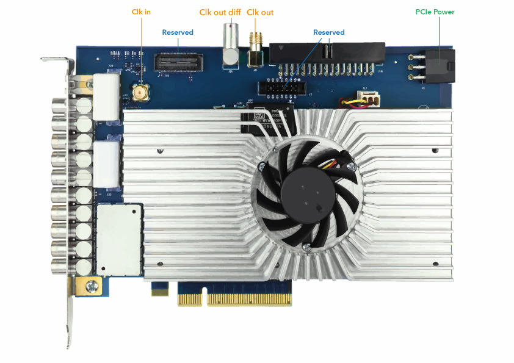

Hardware
========

Installation
------------

The Ndigo6G-12 board can be installed in any PCIe x8 (or higher
amount of lanes) PCIe slot.
If the slot electrically supports less than eight lanes, the board will operate
at lower data throughput rates.

Connect a 6-pin GPU power cable to the connector at the rear of the board
(see :numref:`Figure %s<fig hardware picture>`).

.. note::

    The Ndigo6G-12 does not operate without a 6-pin GPU power connector.

.. _fig hardware picture:

    Overview of an Ndigo6G-12 board. Note the PCIe power connector at the rear
    of the board.

Cooling
-------
The Ndigo6G-12 board is equipped with an active cooling system, ensuring
proper cooling of the device. If, however, the temperature of the ADC chip
exceeds 90 °C (for instance, if the device is operated in inappropriate
environmental conditions, see
:numref:`Section %s<techdata environmental conditions for operation>`),
a warning is issued to the device driver.
When the temperature exceeds 95 °C, the ADC chip is disabled to avoid damaging
the device.

External Inputs and Connectors
------------------------------

Overview
~~~~~~~~

The inputs of the Ndigo6G-12 board are located on the PCI bracket.

:numref:`Figure %s<Fig 2.2>` shows the location of the four analog inputs A to
D (see :numref:`Section %s<analog inputs>`), the four digital TDC inputs 0 to 3 
(see :numref:`Section %s<digital TDC inputs>`), and the two digital control
inputs TRG and GATE (see :numref:`Section %s<digital ctrl inputs>`).

.. _Fig 2.2:
.. figure:: figures/Ndigo6G_connections.*
    :width: 90%

    Input connectors of an Ndigo6G-12 board located on the PCI bracket.

.. _analog inputs:

Analog Inputs
~~~~~~~~~~~~~

.. _Fig 2.4:
.. figure:: figures/InputCircuit.*
    :width: 70%

    Input circuit for each of the four analog channels.

The analog inputs of the ADC are single ended LEMO00 coax connectors.
The inputs have a 50 |nbws| Ω impedance and are AC coupled. The
inputs are converted to a differential signal using a balun.

.. _analog offsets:

Analog Offsets
^^^^^^^^^^^^^^
AC coupling removes the common mode voltage from the input signal. Users
can move the common mode voltage to a value of their choice using the
:cpp:member:`analog_offset <ndigo6g12_configuration::analog_offsets>`
parameter of each channel before sampling.

This feature is useful for highly asymmetric signals, such as pulses
from `TOF <https://www.cronologic.de/applications/tof-mass-spectrometry>`_
spectrometers or `LIDAR <https://www.cronologic.de/applications/lidar>`_
systems. Without analog offset
compensation, the pulses would begin in the middle of the ADC range,
effectively cutting the dynamic range in half
(see :numref:`Figure %s<Fig 2.6>`).
By shifting the DC baseline to one end of the ADC range, the input range
can be used fully, providing the maximum dynamic range. The analog offset
can be set between :math:`\pm` 0.5 |nbws| V.

.. _Fig 2.5:
.. figure:: figures/AnalogOffset_Sine.*

   Users can add analog offset to the input before sampling.

.. _Fig 2.6:
.. figure:: figures/AnalogOffset_Pulse.*

   Asymmetric signal shifted to increase dynamic range.

.. _digital tdc inputs:

Digital TDC Inputs
~~~~~~~~~~~~~~~~~~

The Ndigo6G-12 board includes four TDC channels with 13 ps timing resolution.
The inputs are AC coupled (see :numref:`Figure %s<fig digital input circuit>`).

.. _fig digital input circuit:
.. figure:: figures/InputCircuit_TDC.*

    Input circuit for each of the TDC input channels.

The following members of the :cpp:struct:`ndigo6g12_configuration` struct
configure, respectively, TDC channels 0 to 3:

:cpp:member:`tdc_trigger_offsets[0:3] <ndigo6g12_configuration::tdc_trigger_offsets>`
    Configure the DC offset.

:cpp:member:`trigger[NDIGO6G12_TRIGGER_TDC0:NDIGO6G12_TRIGGER_TDC3] <ndigo6g12_configuration::trigger>`
    Configure if an edge or level trigger is used (relevant, if the TDCs are used in
    :cpp:member:`trigger_blocks <ndigo6g12_configuration::trigger_block>` or
    :cpp:member:`gating_blocks <ndigo6g12_configuration::gating_block>`)
    and if the rising or falling edge of the input signal triggers.

:cpp:member:`tdc_configuration.channel[0:3] <ndigo6g12_tdc_configuration::channel>`
    Configure if
    (:cpp:member:`channel[0:3].enable <ndigo6g12_tdc_channel::enable>`)
    and when
    (:cpp:member:`channel[0:3].gating_block <ndigo6g12_tdc_channel::gating_block>`)
    timestamps are recorded on the TDC channel.

The trigger unit input logic is summarized, as well, in
:numref:`Figure %s<Fig 2.17>`.

.. _digital ctrl inputs:

Digital Control Inputs
~~~~~~~~~~~~~~~~~~~~~~
There are two digital control inputs on the front slot cover called
TRG and GATE.

Input-signals on the inputs TRG and GATE are digitized and routed to the 
Trigger Matrix. They can be used to trigger any of the trigger state machines 
and :doc:`gating blocks <functionality/gating>` with maximum sampling rate.

The digital control inputs are optimally suited to be used as digital triggers 
and gates, and we recommend using them instead of the
:ref:`digital TDC inputs <digital tdc inputs>` for these purposes.

TRG and GATE are configured analogously to the TDC inputs (see
:numref:`Section %s<digital tdc inputs>` and
:numref:`Figure %s<Fig 2.17>`), where indices 4 (5) and
:c:macro:`NDIGO6G12_TRIGGER_TRG` (:c:macro:`NDIGO6G12_TRIGGER_GATE`)
correspond to input TRG (GATE).

The input circuit and trigger logic is identical to the TDC inputs
(see :numref:`Figures %s<fig digital input circuit>` and
:numref:`%s<Fig 2.17>`).

Use Control Inputs as TDCs
^^^^^^^^^^^^^^^^^^^^^^^^^^
The control inputs TRG and GATE can be used as low-resolution TDCs.

.. hint::

    To record timestamps with the TRG or GATE input, set
    :cpp:member:`ndigo6g12_configuration::tdc_configuration.channel[4||5]<ndigo6g12_tdc_channel::enable>`
    to :code:`true`.

The control inputs can detect pulses which have a minimum duration of 3.3 ns.
The dead-time is 32 ns.

.. note::

    The digital *control* inputs TRG and GATE are best suited for triggering
    and controlling gates.

    The digital *TDC* inputs are best suited for measuring precise time stamps.

.. .. note::

..    When used with the TDC, the Trigger input supports negative pulses only.

