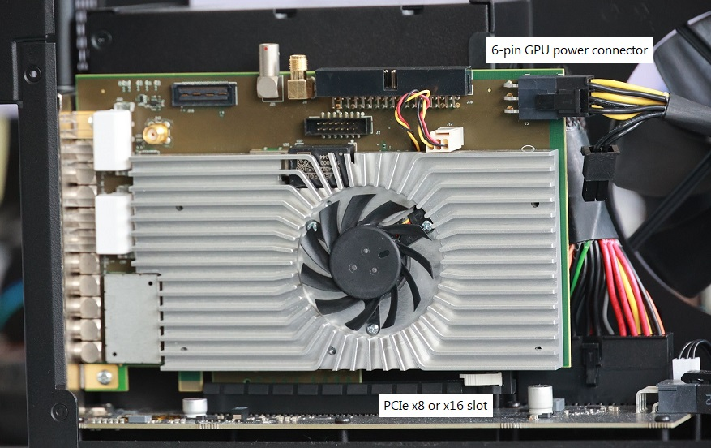

Installation
------------

The Ndigo6G-12 board can be installed in any PCIe x8 (or higher
amount of lanes) PCIe slot.
If the slot electrically supports less than eight lanes, the board will operate
at lower data throughput rates.

Connect a 6-pin GPU power cable to the connector at the rear of the board
(see :numref:`Figure %s<fig hardware picture>`).

.. note::

    The Ndigo6G-12 does not operate without a 6-pin GPU power connector.

.. _fig hardware picture:

    Picture of an Ndigo6G-12 installed in a PCIe x16 slot. Note the power
    connector at the rear of the board.

Cooling
^^^^^^^
The Ndigo6G-12 board is equipped with an active cooling system, ensuring
proper cooling of the device. If, however, the temperature of the ADC chip
exceeds 90 °C (for instance, if the device is operated in inappropriate
environmental conditions, see
:numref:`Section %s<techdata environmental conditions for operation>`),
a warning is issued to the device driver.
When the temperature exceeds 95 °C, the ADC chip is disabled to avoid damaging
the device.
