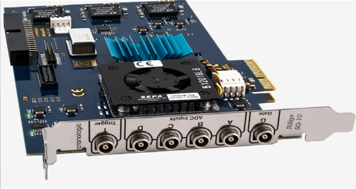

Introduction
============

The Ndigo5G is a digitizer and transient recorder designed to sample
relatively shorts pulses in rapid repetition. It produces a stream of
output packets, each containing data from a single trigger event
together with a timestamp.

By default the Ndigo5G is equipped with a passive cooling system. If
necessary, the unit might be ordered with an active cooling system on demand
(see :numref:`Figure %s<Fig 1.1>`).

Features
--------

-  **10 bit** dynamic range

-  Up to **5 Gsps** sample rate (in 1 channel mode) for increased resolution in time domain.

-  Up to **4 channels** for your individual measurement setups.

-  Digital input with TDC that can also be used for gating and
   triggering.

-  2\ :sup:`nd` digital input for gating or triggering.

-  PCIe 4x 1.1 with **800 |nwbs| MB/s throughput** for simple and fast data
   transfer to most PCs.

-  Multiple boards can be synchronized via reference clock if more channels are required.

-  Extension board available with 4 additional digital inputs.

.. _Fig 1.1:

   Overview of the Ndigo5G equipped with active cooling system.

.. |nbws| unicode:: 0xA0
   :trim:

.. |hyphen| unicode:: U+2012